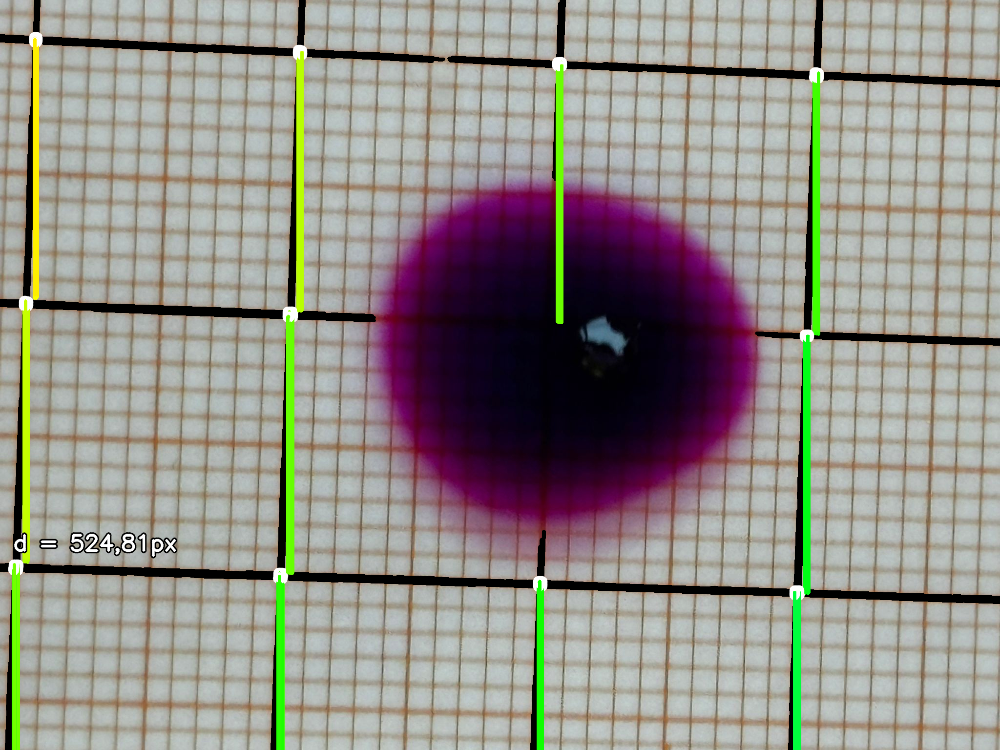
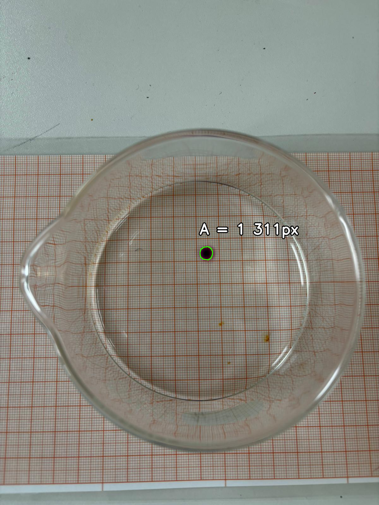
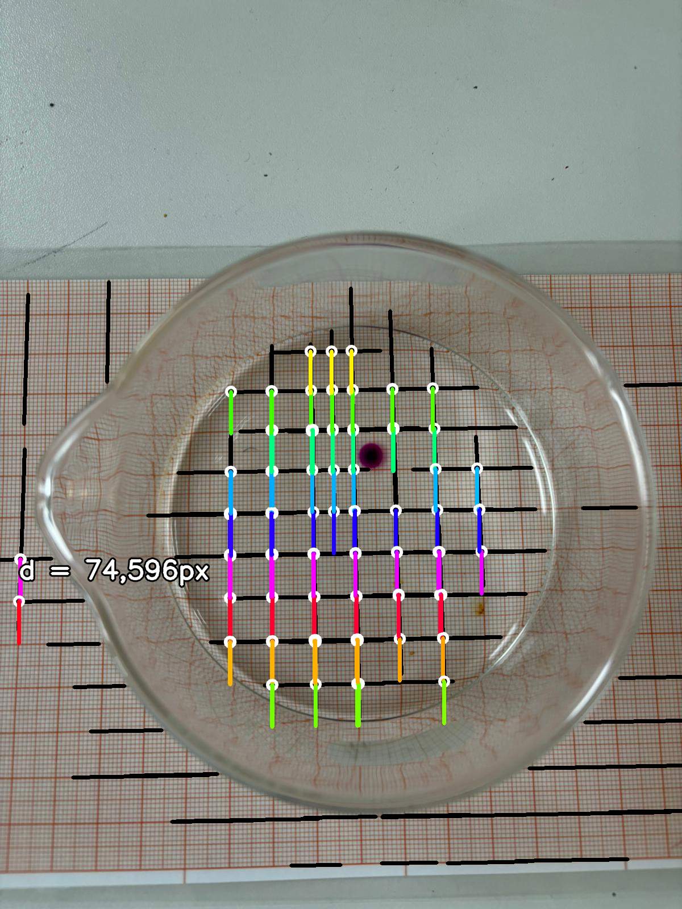
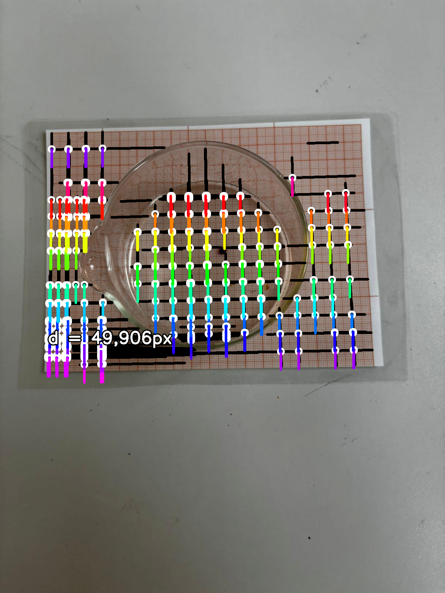

# colorspotter

Made for a friend of mine :3 Finds the purple blob (which is a diffusing potassium permanganate crystal) overlaid on top of graphing paper and uses that to calculate its real-world area to estimate its volume.

In total, the experiment included 3 crystal experiments (A-C) of 6 photos (1-6) of different moments in time each. Unfortunately, the photos had some variation in lighting and huge variations in quality, affecting the measurement accuracy a lot:

## [B3] Very good image (error=±1.33%*)

|Original (2048*1536px)|Found blobs|Found lines|
|---|---|---|
||||

## [A2] Decent image (error=±9.38%*)

|Original (1200*1600px)|Found blobs|Found lines|
|---|---|---|
||||

## [B1] Rock bottom of the barrel (error=±14.03%*)

|Original (1200*1600px)|Found blobs|Found lines|
|---|---|---|
||||

\*: See main python file to find out how this error is calculated
